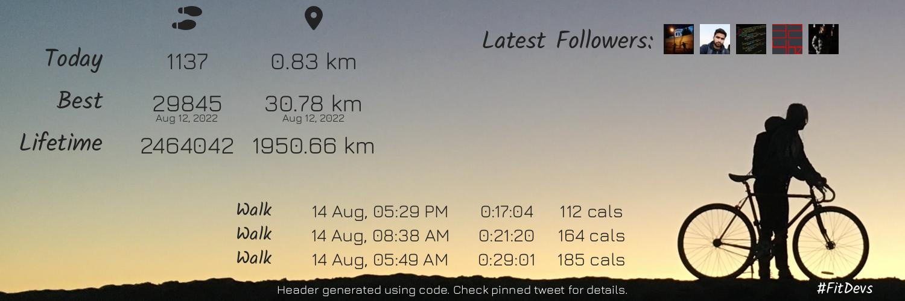

# Dynamic Twitter Header with Fitbit API using Python

A small python script that fetches data from [Fitbit API](https://dev.fitbit.com/) and uses [Python Pillow](https://pypi.org/project/Pillow/) to generate a Twitter Header and update it using [Twitter API ](https://developer.twitter.com/en/docs/twitter-api) / [tweepy](https://www.tweepy.org/)

This was inspired by the [#FitDevs community](https://github.com/FitDevs-withKat/Fitness-Accountability). [Join the FitDevs Community on Discord](https://discord.gg/7Stnsa2JQE)

I made this during a Live Stream on [my Twitch](https://twitch.tv/haideralipunjabi). You can [view the recorded stream on Youtube](https://youtu.be/0ArcwIQveno).

## Demo:




## How to use
1. Install the requirements from `requirements.txt`
    ```bash
    pip install -r requirements.txt
    ```
2. Create a `.env` file using the template from `.env.demo`. Fill it with appropriate values from Fitbit and Twitter.

3. Run `main.py`

## Support

- [Buy Me a Coffee](https://www.buymeacoffee.com/HAliPunjabi)
- [Follow me on Twitter](https://www.twitter.com/HAliPunjabi)
